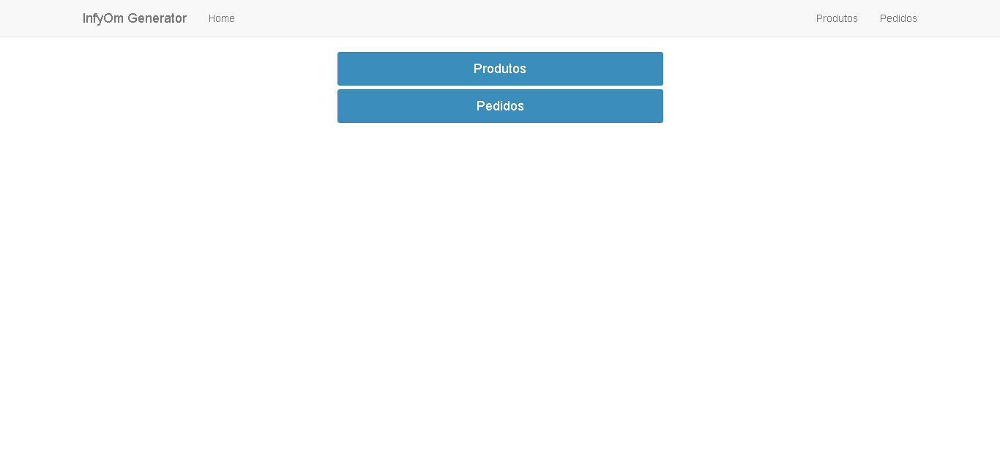

#Teste CooperSystem
O sistema permite o cadastro de produtos com os dados:
- Nome
- Valor Unitário
- Quantidade em estoque
- Situação do produto
 
Caso a quantidade informada for maior que zero, o produto deverá ser cadastrado com a situação **Disponivel**, se a quantidade for zerada a situação deverá ser **Indisponivel**.

É possível efetuar pedidos de um produto, caso o mesmo exista em estoque.

Não existe de cadastro de usuário e, portanto, não existe login.



## Instalação

No diretório do aplicativo, onde se encontram os fontes entrar com o comando:
```
composer install 
```

Caso esteja utilizando Linux ou Mac OS, certifique-se que o arquivo *artisan* possua permissão de execução.
Execute o seguinte comando para tanto:
```
chmod 755 artisan
```

Após a instalação do laravel, deve-se carregar o banco. Para criar o banco use:
```
php artisan migrate
```

## Testes

O teste será salvo num banco na memória no SQLite e destruído após a finalização do mesmo.

Para rodar o teste unitário, certifique-se de estar na raiz do sistema e execute:
```
vendor/bin/phpunit
```

## Execução

Use o comando abaixo para iniciar o servidor do laravel 
```
php artisan serve
```
e abrir o navegador em [http://127.0.0.1:8000](http://127.0.0.1:8000/)

## Construído com

- [PHP](https://php.net) versão 7.2
- [Laravel](https://laravel.com) versão 5.8
- [InfyOm](http://labs.infyom.com/laravelgenerator/) versão 5.8
- [PostgreSQL](https://www.postgresql.org) versão 11.3

## Meta

Marcus Felipe Costa - [@mfelipec](https://twitter.com/mfelipec) - [mfelipec@gmail.com](mailto:mfelipec@gmail.com) ou [marcus@unlocked.com.br](mailto:marcus@unlocked.com.br)

Distribuído sob licença [Apache-2.0](https://opensource.org/licenses/apache-2.0).

[https://github.com/mfelipec](https://github.com/mfelipec)